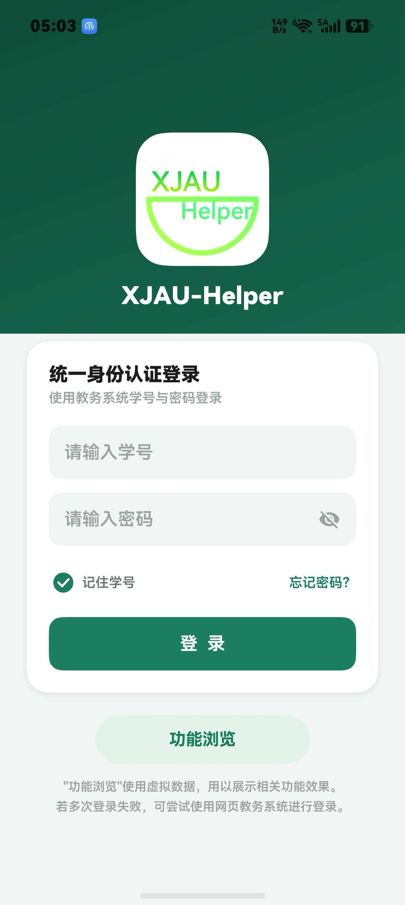
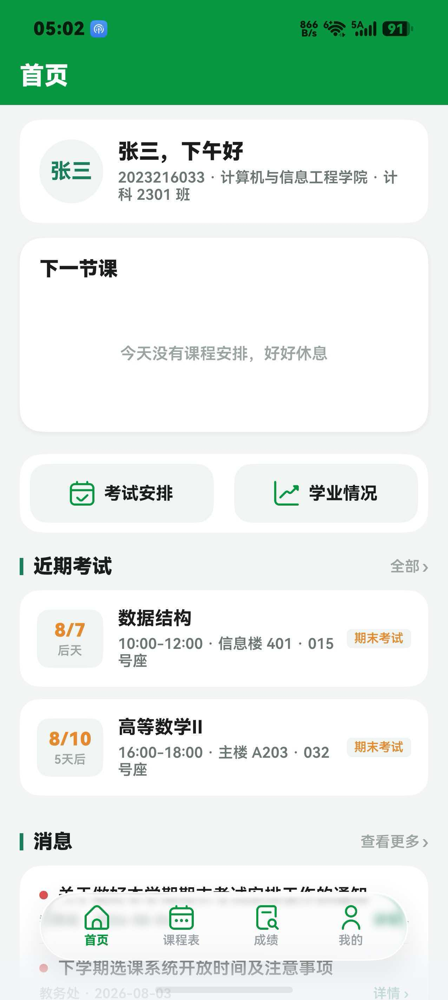
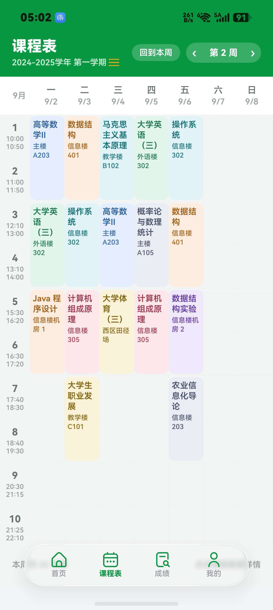
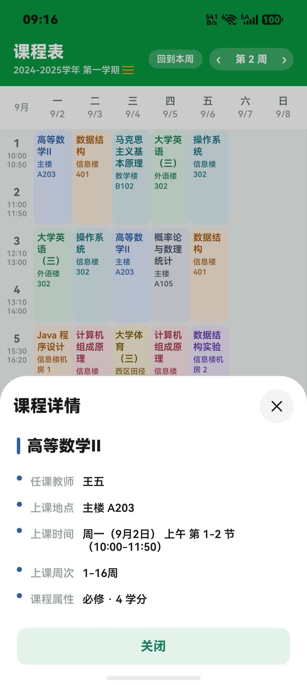
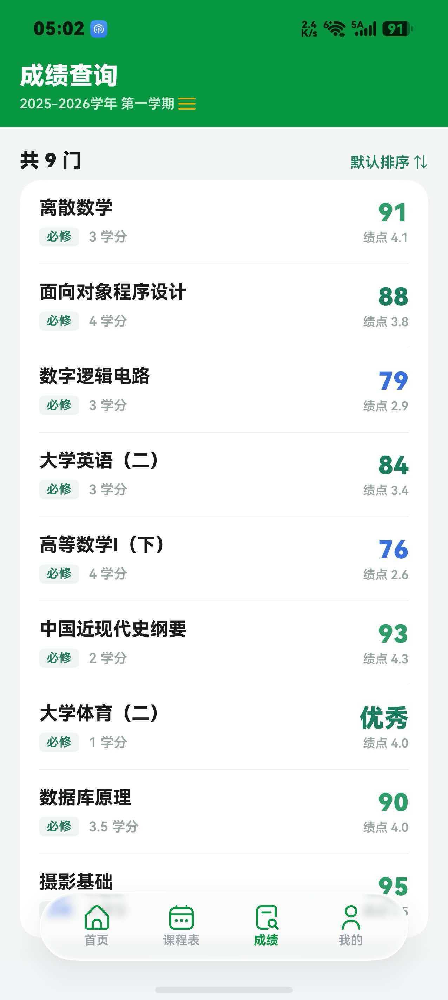
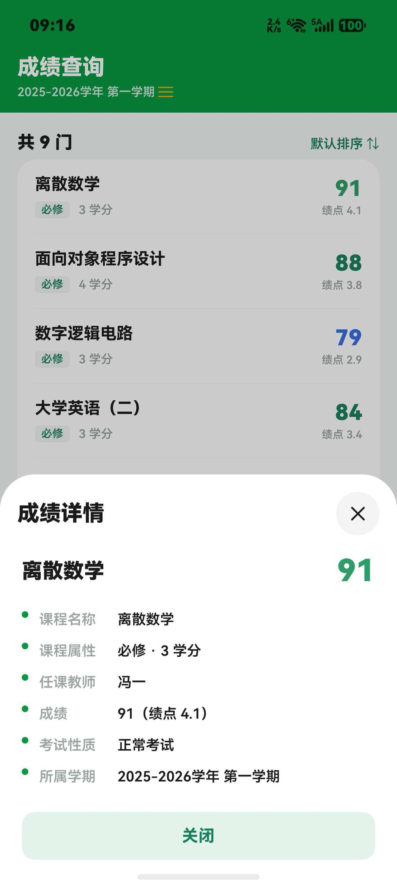
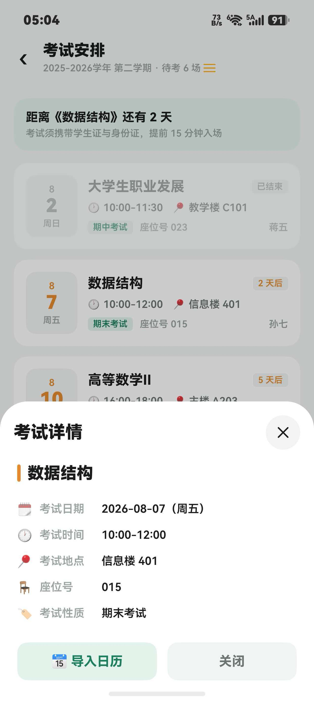
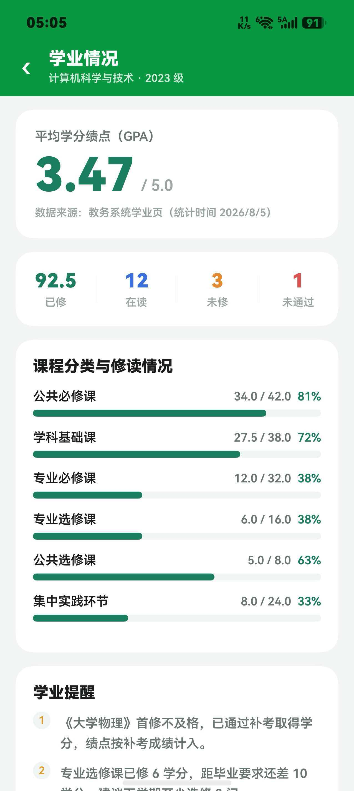

<div align="center">


# XJAU-Helper

**新疆农业大学教务助手 · HarmonyOS 原生应用**

一款为新疆农业大学学生打造的鸿蒙原生校园工具，集成登录、课表、成绩、考试、学业情况、通知公告、桌面卡片等常用功能于一体，数据对接学校正方教务系统。

[](https://github.com/FengHDSL/XJAU-Helper/releases/tag/v1.0.0)
[-orange)](https://developer.huawei.com/consumer/cn/harmonyos/)
[](LICENSE)
[](https://github.com/FengHDSL/XJAU-Helper/releases/download/v1.0.0/XJAU-Helper_V1.0.0.hap)

</div>

---

## 📱 应用截图

<table align="center">
  <tr>
    <td align="center" width="200"><b>登录</b></td>
    <td align="center" width="200"><b>首页</b></td>
    <td align="center" width="200"><b>课程表</b></td>
    <td align="center" width="200"><b>课程详情</b></td>
  </tr>
  <tr>
    <td></td>
    <td></td>
    <td></td>
    <td></td>
  </tr>
  <tr>
    <td align="center"><b>成绩查询</b></td>
    <td align="center"><b>成绩详情</b></td>
    <td align="center"><b>考试安排</b></td>
    <td align="center"><b>学业情况</b></td>
  </tr>
  <tr>
    <td></td>
    <td></td>
    <td></td>
    <td></td>
  </tr>
</table>

---

## ✨ 功能特性

### 核心功能

| 功能 | 说明 |
|------|------|
| 🔐 统一身份认证 | 学号密码登录（RSA 加密传输），历史账号快速填充，服务端验证码 |
| 📅 课程表 | 周视图课表，周次/学期切换，课程详情（教师、教室、节次、周次、属性着色） |
| 📝 考试安排 | 考试时间、地点、座位查询，最近考试倒计时，一键导入系统日历 |
| 🏆 成绩查询 | 成绩列表与绩点展示，学期切换，成绩详情按课程属性着色 |
| 🎓 学业情况 | GPA、学分完成度、课程分类统计 |
| 📢 通知公告 | 公告列表与详情阅读 |
| 🎨 主题定制 | 顶栏主题色：中国红 / 天空蓝 / 农大绿，深浅色模式自动适配 |
| 🖥️ 横屏适配 | 横屏 / 平板下内容自适应居中显示 |

### 桌面卡片

| 卡片 | 尺寸 | 功能 |
|------|------|------|
| 课程预告 | 2×2 | 今日/明日课程预览，点击切换 |
| 考试倒计时 | 2×2 | 最近考试天数与详情 |

---

## 🛠️ 技术栈

| 类别 | 技术 |
|------|------|
| 平台 | HarmonyOS NEXT (API 26) |
| 语言 | ArkTS / ArkUI |
| 网络 | @ohos.net.http（正方教务系统接口） |
| 存储 | @ohos.data.preferences（本地缓存） |
| UI | HDS Design Kit、沉浸式悬浮底栏、系统颜色资源适配深色模式 |
| 加密 | RSA PKCS#1 v1.5（密码加密传输） |
| 桌面卡片 | FormExtensionAbility + LocalStorage 数据绑定 |

---

## 📦 构建 & 运行

```text
1. 安装 DevEco Studio 5.x
2. Clone 本仓库，用 DevEco Studio 打开
3. 使用华为账号 Auto-Sign 签名后连接设备或启动模拟器，点击运行
```

> 💡 内置"功能浏览"模式，未登录时可使用本地模拟数据体验全部界面。

---

## 📁 项目结构

```text
XJAU-Helper/
├── AppScope/                # 应用级配置与图标
├── docs/                    # README 资源
│   ├── icon.png             # 应用图标
│   └── screenshots/         # 应用截图
├── entry/                   # 主模块
│   └── src/main/
│       ├── ets/             # ArkTS 源码
│       │   ├── api/         # 教务系统接口
│       │   ├── common/      # 工具与状态
│       │   ├── model/       # 数据模型
│       │   ├── view/        # 页面与组件
│       │   ├── widgets/     # 桌面卡片
│       │   └── entryability/# 入口与扩展能力
│       └── resources/       # 资源文件
├── hvigor/                  # 构建配置
├── build-profile.json5      # 工程配置
├── LICENSE                  # MIT 许可证
└── README.md                # 本文件
```

---

## ⚠️ 已知限制

- **教务接口依赖学校系统**：真实数据依赖学校教务系统（正方 zftal-ui v5）的接口稳定性，若学校调整接口，需同步更新代码
- **功能浏览模式**：未登录时使用本地模拟数据，仅用于界面体验，请勿用于真实数据查询

---

## 🤝 致谢

本项目桌面卡片、界面布局与交互实现参考了 [**HiXD**](https://github.com/PollenWang6/HiXD)（西安电子科技大学校园助手），感谢该项目的开源分享与 UI 设计思路。

本项目教务系统接口探索参考了 [**Traintime PDA / XDYou**](https://github.com/BenderBlog/traintime_pda)（MPL-2.0），感谢该项目的接口探索工作。

---

## 📄 License

[MIT](LICENSE) © 2026 FengHDSL