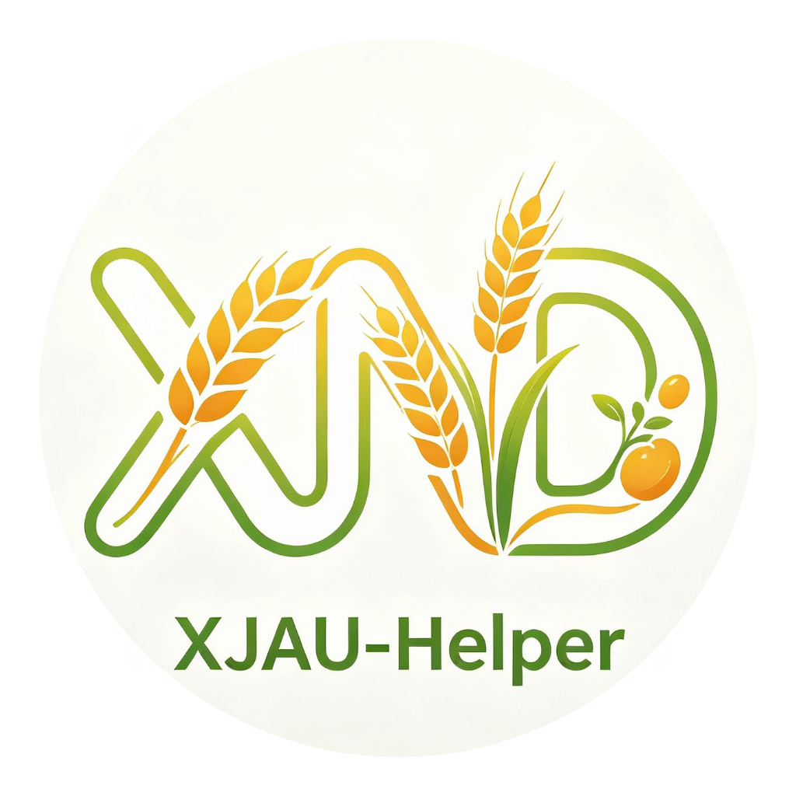
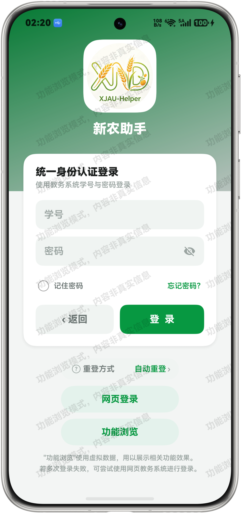
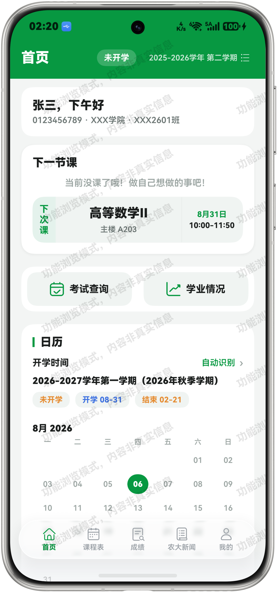
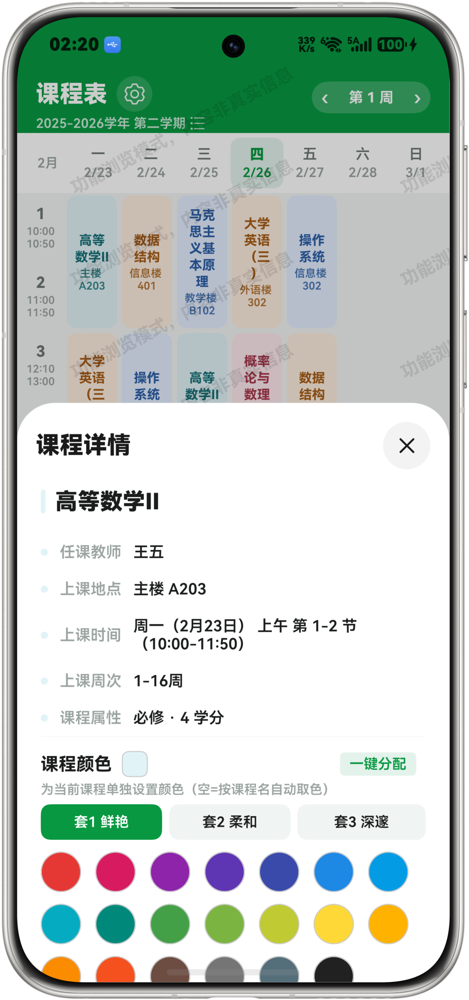
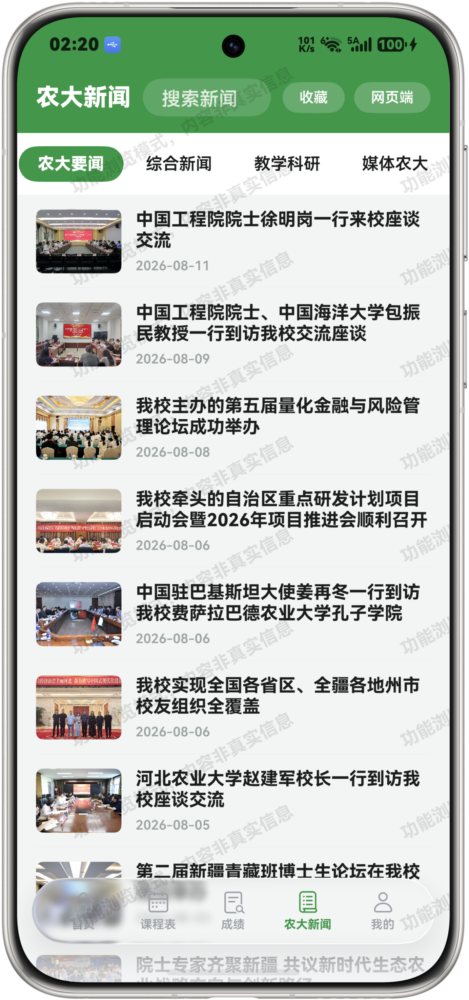
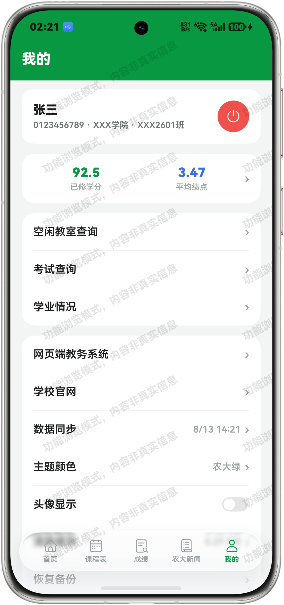
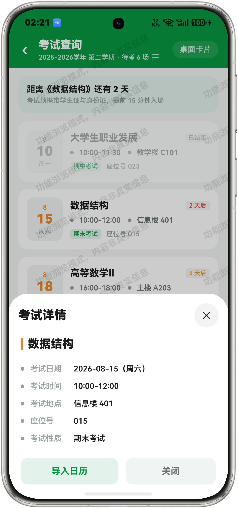
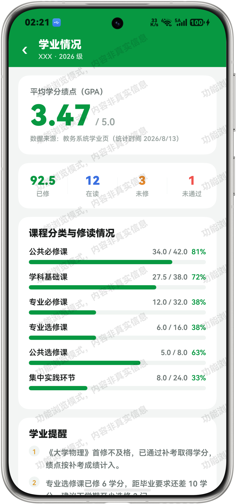

<div align="center">



# 新农助手（XJAU-Helper）

**新农大助手 · HarmonyOS 原生应用**

一款为新疆农业大学学生打造的鸿蒙原生校园工具，集成登录、课表、成绩、考试、学业情况、校历信息、通知公告、空闲教室查询、农大新闻等常用功能于一体，数据对接学校正方教务系统与教务处官网。
注：本应用非新疆农业大学官方应用！也不存在合作关系！

[](https://github.com/FengHDSL/XJAU-Helper/releases/tag/v1.2.3)
[-orange)](https://developer.huawei.com/consumer/cn/harmonyos/)
[](LICENSE)
[](https://github.com/FengHDSL/XJAU-Helper/releases/download/v1.2.3/XJAU-Helper_v1.2.3.hap)

</div>

---

## 应用截图

<table align="center">
  <tr>
    <td align="center" width="200"><b>登录</b></td>
    <td align="center" width="200"><b>首页</b></td>
    <td align="center" width="200"><b>课程表</b></td>
  </tr>
  <tr>
    <td></td>
    <td></td>
    <td></td>
  </tr>
  <tr>
    <td align="center" width="200"><b>成绩查询</b></td>
    <td align="center" width="200"><b>农大新闻</b></td>
    <td align="center" width="200"><b>我的</b></td>
  </tr>
  <tr>
    <td></td>
    <td></td>
    <td></td>
  </tr>
  <tr>
    <td align="center" width="200"><b>考试查询</b></td>
    <td align="center" width="200"><b>学业情况</b></td>
    <td align="center" width="200"></td>
  </tr>
  <tr>
    <td></td>
    <td></td>
    <td></td>
  </tr>
</table>

---

## 功能特性

### 核心功能

| 功能 | 说明 |
|------|------|
|  登录  | 学号密码登录（RSA PKCS#1 v1.5 加密），历史账号一键填充，服务端验证码 + 网页版登录兜底 + 忘记密码跳转学校官网 |
| 课程表 | 周视图课表，周次/学期切换；课程详情（教师、教室、节次、周次、属性着色）；支持更换背景/网格/纯色背景/表头颜色/格子高度/圆角/边框/文字等超多设置项；**左右滑动切换上一周/下一周**；支持手动调节开学时间 |
| 考试查询 | 考试时间、地点、座位号查询，最近考试倒计时，按剩余天数分级配色（红紧急 / 黄中等 / 绿充足）；支持导入系统日历 |
| 成绩查询 | 学期成绩列表与平均分 / GPA 展示（按学校「课程及学分」办法自动换算） |
| 学业情况 | GPA、学分完成度、课程分类统计、学历预警；对接教务处官网「学期校历」文章通知 |
| 日历 | 按月分块的正常日历样式，左右滑动查看月份，未开学/学期外日期灰色显示，支持手动调节开学时间 |
| 空闲教室查询 | 数据对接教务系统空闲教室查询页面，支持按校区/楼号/场地类别/时间筛选 |
| 农大新闻 | 对接新闻网官网「农大要闻 / 综合新闻 / 教学科研 / 媒体农大」四大板块，支持站内搜索、收藏、分享、下拉刷新、滚动翻页 |
| 外部链接页 | 应用内 WebView 浏览教务处官网/教务系统/新闻网任意页面，右上角**复制链接/分享**胶囊按钮（链接自动变成网页标题） |

### 桌面卡片

| 卡片 | 尺寸 | 功能 |
|------|------|------|
| 课程预告 | 2×2 | 今日/明日课程预览，点击切换 |
| 考试倒计时 | 2×2 | 最近考试天数与详情 |

### 个性化设置

- **主题色**：支持中国红、天空蓝、农大绿三色主题
- **深色模式**：自动跟随系统深色模式开关
- **课表样式**：自定义网格、表头、边框、底色、格子高度、圆角、文字大小与对齐
- **课程颜色**：每门课程独立颜色，支持一键分配色
- **背景图**：支持自定义课表背景图

---

## 技术栈

| 类别 | 技术 |
|------|------|
| 平台 | HarmonyOS NEXT（最低要求 API 24，即 HarmonyOS 6.1） |
| 语言 | ArkTS / ArkUI |
| 网络 | @ohos.net.http（正方教务系统 + 教务处官网） |
| 存储 | @ohos.data.preferences（本地缓存）+ AppStorage（学期切换广播） |
| UI | HDS Design Kit（沉浸式悬浮底栏）、系统颜色资源适配深色模式、Swiper 日历左右滑动 |
| 加密 | RSA PKCS#1 v1.5（密码加密传输） |
| 分享 | @kit.ShareKit systemShare（外部链接页分享面板） |
| 动画 | animateTo + TransitionEffect（登录页历史账号展开过渡） |

---

## 构建

```text
1. 安装 DevEco Studio 26.0.0 及以上版本
2. Clone 本仓库，用 DevEco Studio 打开
3. 使用华为账号 Auto-Sign 签名后连接设备或启动模拟器，点击运行
```

> 💡 内置「功能浏览」模式，未登录时可使用本地模拟数据体验全部界面（带全屏水印提醒）。
> 💡 v1.2.3 起兼容 API 24（HarmonyOS 6.1），并初步适配平板大屏（课程表界面）。

---

## 项目结构

```text
XJAU-Helper/
├── AppScope/                # 应用级配置与图标
├── docs/                    # README 资源
│   ├── icon.png             # 应用图标
│   └── screenshots/         # 应用截图
├── entry/                   # 主模块
│   └── src/main/
│       ├── ets/             # ArkTS 源码
│       │   ├── api/         # 教务系统接口
│       │   ├── common/      # 工具与状态
│       │   ├── model/       # 数据模型
│       │   ├── view/        # 页面与组件
│       │   └── pages/       # 入口
│       └── resources/       # 资源文件
├── config/                  # 接口配置中心（远程配置 JSON）
├── hvigor/                  # 构建配置
├── build-profile.json5      # 工程配置
├── LICENSE                  # MIT 许可证
└── README.md                # 本文件
```

---

## 已知限制

- **教务接口依赖学校系统**：真实数据依赖学校教务系统与教务处官网链接，若学校调整功能网址，需同步更新代码
- **功能浏览模式**：未登录时使用本地模拟数据（含占位头像/学院/班级/学号），仅用于界面体验，请勿用于真实数据查询
- **客户端 PDF 解析**：校历 PDF 表头为矢量图，客户端无法可靠自动转换；目前由预置数据提供，校历更新需要版本发布
- **教务接口风控**：学校网关可能对非浏览器请求做概率性拦截（间歇性），遇风控时可改用「网页版登录」模式或等待 24 小时自动解除

---

## AI 辅助开发

本项目由 AI 辅助完成开发：

- **架构**：通过与 AI 协作完成正方教务系统功能探索与字段映射
- **代码实现**：ArkTS 业务逻辑、UI 交互、跨页面状态管理由 AI 辅助编写与重构
- **调试与修复**：编译错误排查（ArkTS 严格规范）、正则解析、空教室导出 Excel 解析等问题由 AI 辅助定位与修复
- **工程清理**：废弃 API/资源/代码扫描与清理由 AI 辅助完成

开发者负责需求决策、功能边界、产品体验与最终验证；AI 负责实现探索、代码编写与迭代优化。**仅供学习交流使用，严禁用于商业用途！**

---

## 致谢

本项目桌面卡片、界面布局与交互实现参考了 [**HiXD**](https://github.com/PollenWang6/HiXD)（西安电子科技大学校园助手），感谢该项目的开源分享与 UI 设计思路。

本项目教务系统接口探索参考了 [**Traintime PDA / XDYou**](https://github.com/BenderBlog/traintime_pda)（MPL-2.0），感谢该项目的接口探索工作。

---

## License

本项目基于 MIT 协议开源，详见 [LICENSE](LICENSE)。
