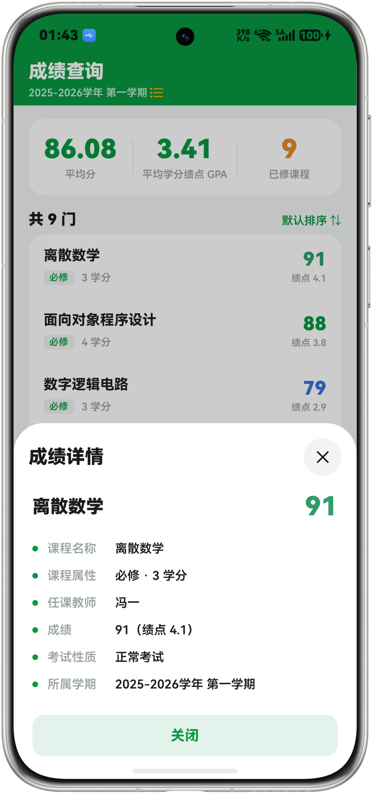
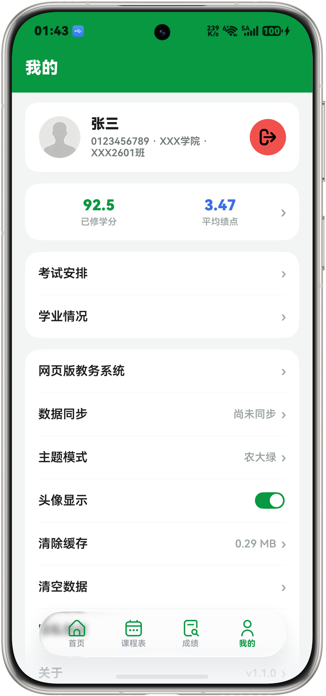

<div align="center">


# XJAU-Helper

**新疆农业大学教务助手 · HarmonyOS 原生应用**

一款为新疆农业大学学生打造的鸿蒙原生校园工具，集成登录、课表、成绩、考试、学业情况、校历信息、通知公告等常用功能于一体，数据对接学校正方教务系统与教务处官网。

[](https://github.com/FengHDSL/XJAU-Helper/releases/tag/v1.1.0)
[-orange)](https://developer.huawei.com/consumer/cn/harmonyos/)
[](LICENSE)
[](https://github.com/FengHDSL/XJAU-Helper/releases/download/v1.1.0/XJAU-Helper_v1.1.0.hap)

</div>

---

## 📱 应用截图

<table align="center">
  <tr>
    <td align="center" width="200"><b>登录</b></td>
    <td align="center" width="200"><b>首页</b></td>
    <td align="center" width="200"><b>课程表</b></td>
    <td align="center" width="200"><b>成绩查询</b></td>
  </tr>
  <tr>
    <td></td>
    <td></td>
    <td></td>
    <td></td>
  </tr>
  <tr>
    <td align="center"><b>我的</b></td>
    <td align="center" width="200"><b>考试查询</b></td>
    <td align="center" width="200"><b>学业情况</b></td>
    <td align="center" width="200"><b>消息</b></td>
  </tr>
  <tr>
    <td></td>
    <td></td>
    <td></td>
    <td></td>
  </tr>
</table>

---

## ✨ 功能特性

### 核心功能

| 功能 | 说明 |
|------|------|
| 🔐 统一身份认证 | 学号密码登录（RSA PKCS#1 v1.5 加密），历史账号一键填充（"最近"标记居行首）+ 过渡动画，服务端验证码 + 忘记密码跳转学校官网 |
| 📅 课程表 | 周视图课表，按"周一为首"对齐，周次/学期切换；课程详情（教师、教室、节次、周次、属性着色），学号/密码输入框精简 |
| 📝 考试查询 | 考试时间、地点、座位号查询，最近考试倒计时，按剩余天数分级配色（红紧急 / 黄中等 / 绿充足） |
| 🏆 成绩查询 | 学期成绩列表与平均分 / GPA 展示（按学校「课程及学分」办法自动换算），详情页圆点居中对齐 |
| 🎓 学业情况 | GPA、学分完成度、课程分类统计、学历预警 |
| 📅 校历信息 | 对接教务处官网「学期校历」栏目最新两条通知 |
| 📅 日历 | 按月分块的正常日历样式，左右滑动查看月份，未开学/学期外日期灰色显示，附校历说明 |

### 桌面卡片

| 卡片 | 尺寸 | 功能 |
|------|------|------|
| 课程预告 | 2×2 | 今日/明日课程预览，点击切换 |
| 考试倒计时 | 2×2 | 最近考试天数与详情 |

---

## 🛠️ 技术栈

| 类别 | 技术 |
|------|------|
| 平台 | HarmonyOS NEXT (API 26) |
| 语言 | ArkTS / ArkUI |
| 网络 | @ohos.net.http（正方教务系统 + 教务处官网） |
| 存储 | @ohos.data.preferences（本地缓存）+ AppStorage（学期切换广播） |
| UI | HDS Design Kit（沉浸式悬浮底栏）、系统颜色资源适配深色模式、Swiper 日历左右滑动 |
| 加密 | RSA PKCS#1 v1.5（密码加密传输） |
| 动画 | animateTo + TransitionEffect（登录页历史账号展开过渡） |

---

## 📦 构建 & 运行

```text
1. 安装 DevEco Studio 5.x
2. Clone 本仓库，用 DevEco Studio 打开
3. 使用华为账号 Auto-Sign 签名后连接设备或启动模拟器，点击运行
```

> 💡 内置"功能浏览"模式，未登录时可使用本地模拟数据体验全部界面。

### 沙箱命令行构建（参考）

```bash
export NODE_HOME="/c/Users/panda/.workbuddy/binaries/node/versions/22.22.2"
export PATH="$NODE_HOME:$PATH"
export DEVECO_SDK_HOME="C:/Users/panda/Downloads/Edge/command-line-tools/sdk"
export DEVECO_NODE_HOME="C:/Users/panda/Downloads/Edge/command-line-tools/tool/node"
export JAVA_HOME="/d/App/DevEco Studio/jbr"; export PATH="$JAVA_HOME/bin:$PATH"
export NODE_OPTIONS=""
cd /c/Users/panda/xjau
node "C:/Users/panda/Downloads/Edge/command-line-tools/hvigor/bin/hvigorw.js" clean assembleHap --no-daemon
# 产物：entry/build/default/outputs/default/entry-default-signed.hap
```

---

## 📁 项目结构

```text
XJAU-Helper/
├── AppScope/                # 应用级配置与图标
├── docs/                    # README 资源
│   ├── icon.png             # 应用图标
│   └── screenshots/         # 应用截图
├── entry/                   # 主模块
│   └── src/main/
│       ├── ets/             # ArkTS 源码
│       │   ├── api/         # 教务系统接口
│       │   ├── common/      # 工具与状态
│       │   ├── model/       # 数据模型
│       │   ├── view/        # 页面与组件
│       │   └── pages/       # 入口
│       └── resources/       # 资源文件
├── hvigor/                  # 构建配置
├── build-profile.json5      # 工程配置
├── LICENSE                  # MIT 许可证
└── README.md                # 本文件
```

---

## ⚠️ 已知限制

- **教务接口依赖学校系统**：真实数据依赖学校教务系统（正方 zftal-ui v5）与教务处官网接口的稳定性，若学校调整接口，需同步更新代码
- **功能浏览模式**：未登录时使用本地模拟数据（含占位头像/学院/班级/学号），仅用于界面体验，请勿用于真实数据查询
- **客户端 PDF 解析**：校历 PDF 表头为矢量图，客户端无法可靠自动转换；目前由预置数据提供，校历更新需要版本发布

---

## 🤝 致谢

本项目桌面卡片、界面布局与交互实现参考了 [**HiXD**](https://github.com/PollenWang6/HiXD)（西安电子科技大学校园助手），感谢该项目的开源分享与 UI 设计思路。

本项目教务系统接口探索参考了 [**Traintime PDA / XDYou**](https://github.com/BenderBlog/traintime_pda)（MPL-2.0），感谢该项目的接口探索工作。

---

## 📄 License

本项目基于 MIT 协议开源，详见 [LICENSE](LICENSE)。
